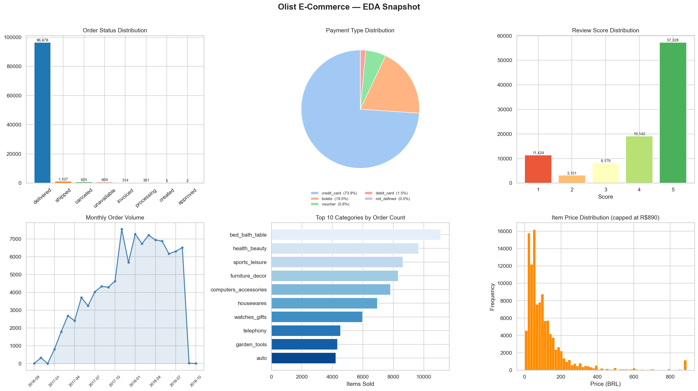
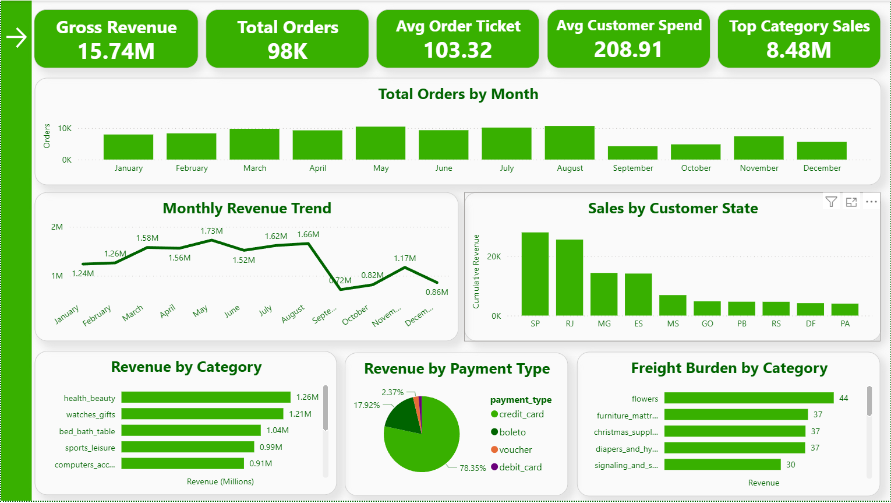
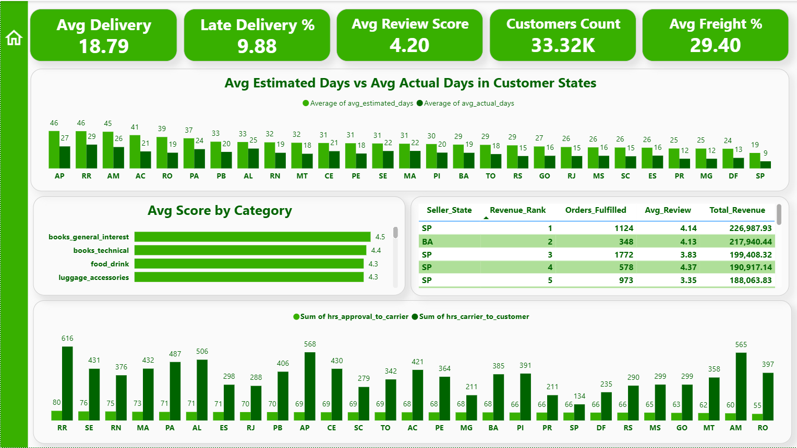

# 📊 Olist E-Commerce Performance Analysis

An end-to-end data analysis project on the **Olist Brazilian E-Commerce** dataset — covering data cleaning, SQL-based business analysis, and an interactive Power BI dashboard, wrapped up with an executive insights report.

The pipeline: raw CSVs → cleaned with **Pandas** → loaded into **SQLite** → analyzed with **15 SQL business queries** → exported to CSV → visualized in **Power BI** → summarized in an **executive insights report**.

---

## 📁 Dataset

This project uses the **Brazilian E-Commerce Public Dataset by Olist**, a real (anonymized) commercial dataset of ~100K orders placed between 2016 and 2018 across multiple marketplaces in Brazil. It includes order status, pricing, payment and freight details, customer location, product attributes, and customer reviews.

🔗 **Dataset link:** [Brazilian E-Commerce Public Dataset by Olist — Kaggle](https://www.kaggle.com/datasets/olistbr/brazilian-ecommerce)

> The raw CSV files are not included in this repository — download them from the Kaggle link above to reproduce the analysis.

---

## 🗂 Repository Structure

```
├── Insights_Report__Olist_ECommerce_Performance.pdf   # Executive insights report
├── Pandas_Analysis.ipynb                               # Data cleaning + SQL analysis notebook
├── power_bi_exports/                                   # 15 CSV outputs feeding the Power BI dashboard
│   ├── q1_monthly_revenue.csv
│   ├── q2_top_categories.csv
│   ├── q3_customer_ltv.csv
│   ├── q4_seller_ranking.csv
│   ├── q5_delivery_time.csv
│   ├── q6_payment_split.csv
│   ├── q7_review_by_category.csv
│   ├── q8_late_delivery.csv
│   ├── q9_mom_growth.csv
│   ├── q10_rfm.csv
│   ├── q11_cumulative_revenue.csv
│   ├── q12_state_market_share.csv
│   ├── q13_co_purchase.csv
│   ├── q14_delivery_funnel.csv
│   └── q15_freight_burden.csv
├── License
├── Pandas_Analysis_py
├── Pandas_Analysis_HTML                                         
│── dashboard_sales_overview.png
│── dashboard_delivery_logistics.png
│── olist_eda_snapshot.png
└── README.md
```

---

## 🛠 Tools & Tech Stack

| Stage | Tools |
|---|---|
| Data Cleaning & EDA | Python, Pandas, NumPy, Matplotlib, Seaborn |
| Database & Analysis | SQLite, SQLAlchemy, SQL (window functions: `DENSE_RANK`, `LAG`, `NTILE`, `RANK`, running totals) |
| Dashboard | Power BI |
| Reporting | Executive Insights Report (PDF) |

---

## 🧹 Data Cleaning

Performed in `Pandas_Analysis.ipynb` before any analysis:

- Removed duplicate rows across all raw tables.
- Deduplicated the **geolocation** dataset by collapsing multiple lat/lng entries down to one representative row per zip code prefix.
- Converted all order-related date columns (`order_purchase_timestamp`, `order_approved_at`, `order_delivered_carrier_date`, `order_delivered_customer_date`, `order_estimated_delivery_date`) to datetime, keeping missing values as `NaT` (they represent orders that never reached that stage, e.g. cancellations) rather than imputing them.
- Filled missing review titles/messages with placeholder text (`"No Title"` / `"No Comment"`), since a blank field simply means the customer left no comment.
- Filled missing product category names with `"unknown"`, and missing product dimension/weight fields with the column median.
- Verified zero missing values and zero duplicates post-cleaning, then loaded all cleaned tables into a local **SQLite** database (`olist.db`).

---

## 🔎 Exploratory Data Analysis

A 6-panel EDA snapshot was generated with Matplotlib/Seaborn covering order status distribution, payment type split, review score distribution, monthly order volume, top 10 categories by order count, and item price distribution.



---

## 🧮 SQL Analysis

15 business questions were answered by querying the cleaned SQLite database directly in the notebook, with each result exported to `power_bi_exports/` for use in Power BI:

1. **Monthly Revenue Trend** — product, freight, and gross revenue by month
2. **Top 10 Product Categories by Revenue**
3. **Customer Lifetime Value (Top 20)** — by `customer_unique_id`
4. **Seller Performance Ranking** — revenue-ranked sellers using `DENSE_RANK`
5. **Actual vs Estimated Delivery Days by State**
6. **Payment Method Split & Installment Behavior**
7. **Review Score Breakdown by Category**
8. **Late Delivery Rate by Seller State**
9. **Month-over-Month Revenue Growth** — using `LAG`
10. **RFM Segmentation** — Recency/Frequency/Monetary quintiles via `NTILE`
11. **Cumulative Revenue Running Total**
12. **State Revenue Market Share + Pareto Cumulative %**
13. **Top Product Pairs Bought Together** — co-purchase self-join
14. **Order-to-Delivery Funnel Timing by Stage (Hours)** — approval → carrier → customer
15. **Freight Cost as % of Product Revenue by Category** — ranked with `RANK`

---

## 📈 Power BI Dashboard

An interactive, two-page Power BI dashboard was built on top of the SQL query exports.

### Page 1 — Sales & Revenue Overview
KPIs: **Gross Revenue 15.74M** · **Total Orders 98K** · **Avg Order Ticket 103.32** · **Avg Customer Spend 208.91** · **Top Category Sales 8.48M**

Visuals: Total Orders by Month, Monthly Revenue Trend, Sales by Customer State, Revenue by Category, Revenue by Payment Type, Freight Burden by Category.



### Page 2 — Delivery, Logistics & Customer Experience
KPIs: **Avg Delivery 18.79 days** · **Late Delivery % 9.88** · **Avg Review Score 4.20** · **Customers Count 33.32K** · **Avg Freight % 29.40**

Visuals: Avg Estimated vs Avg Actual Days in Customer States, Avg Score by Category, Seller Performance table (Revenue Rank, Orders Fulfilled, Avg Review, Total Revenue), and Order-to-Delivery Funnel Timing by state (approval-to-carrier vs carrier-to-customer hours).



---

## 💡 Key Insights

*(from `Insights_Report__Olist_ECommerce_Performance.pdf`)*

**1. Revenue Growth**
Gross revenue reached 15.74M across ~98K orders (avg ticket 103.32, avg customer spend 208.91). Revenue climbed from 1.24M in January to a peak of 1.66M in August, then fell sharply to 0.72M in September with only a partial recovery by December. A 53.28% month-over-month spike in November 2017 (the largest jump in the dataset, likely a Black Friday/holiday surge) capped a strong growth phase — but five of the seven months from February–August 2018 showed flat or negative MoM revenue growth even as order counts held steady at 6,000–7,000/month, signaling the business shifted from high growth into a plateau.

**2. Delivery Performance — The Estimate-Padding Gap**
Average delivery time is 18.79 days with a 9.88% late-delivery rate. Northern/remote states (AP, RR, AM) are quoted the longest windows (~45–46 estimated days) but actually arrive in ~26–29 days, while SP — the fastest state — is promised just 19 days and delivers in 8.8 days. Estimates are padded everywhere, but far more so in the North; SP's tighter promise window means it racks up the most late deliveries despite being fastest overall. For remote states like RR, the carrier-to-customer leg alone consumes ~616 hours (~25.7 days) versus ~80 hours for approval-to-carrier — the delay sits almost entirely in last-mile logistics, not seller processing.

**3. Customer Satisfaction Varies Sharply by Category**
Overall average review score is 4.20. Low-footprint categories score highest (books_general_interest 4.5, books_technical 4.4), while bulkier, high-volume categories underperform — sports_leisure sits at 4.11 despite being a top revenue category worth roughly 988K, meaning a modest satisfaction lift there would carry disproportionate weight on brand perception.

**4. Payment Behavior & Freight Cost Burden**
Credit card dominates at 78.35% of revenue (73.92% of transactions, avg 3.5 installments); boleto is a distant second (17.92% of revenue, single-installment, upfront). The platform-wide average freight is 29.40% of item price, with flowers (44%), furniture/mattress (37%), Christmas supplies (37%), and diapers & hygiene (37%) carrying the heaviest freight-to-revenue ratios — signaling these categories are far less profitable per order than their revenue suggests.

**5. Geographic Revenue Concentration**
Sales are heavily skewed toward SP and RJ, with SP, BA, and RJ repeatedly dominating both order volume and seller revenue rankings — top revenue-ranked sellers are almost entirely SP-based. This supports operational efficiency (short delivery times, low freight burden in SP) but leaves the business exposed if pressure hits that single region.

**6. Seller Performance Disparities**
The #1-ranked seller (SP, 1,124 orders) holds a strong 4.14 average review, but the #5-ranked seller (SP, 973 orders, 188K revenue) trails at only 3.35 — the lowest score among the top 5 revenue generators — while a lower-volume #4 seller (578 orders) posts the group's best score at 4.37. High revenue and order volume don't reliably correlate with satisfaction, exposing a retention/reputation risk inside the platform's own top accounts.

---

## 🎯 Recommendations

*(from `Insights_Report__Olist_ECommerce_Performance.pdf`)*

- **Investigate the post-peak growth plateau** — examine whether average order value or category mix shifted after the November 2017 peak, and design re-acceleration levers (loyalty incentives, bundling, upsell campaigns) aimed at lifting order value rather than just order count.
- **Prioritize last-mile carrier partnerships in the North region** — since carrier-to-customer transit (not seller handling) is the dominant delay for RR, AP, and AM, renegotiate or diversify last-mile carrier contracts there rather than tightening seller-side SLAs.
- **Investigate Sports & Leisure category quality** — audit product listings, packaging, and post-purchase experience given its high revenue but below-average review score.
- **Reassess pricing or packaging for high-freight-burden categories** — flowers, furniture/mattress, and diapers & hygiene are losing a disproportionate share of revenue to shipping; consider regional fulfillment hubs, minimum order thresholds, or price adjustments.
- **Audit the underperforming top-5 seller** — conduct a quality review of the SP-based seller ranked #5 by revenue but lowest by review score (3.35).
- **De-risk geographic concentration** — invest in seller recruitment and marketing in underrepresented states to reduce dependency on the SP/RJ corridor over time.

---

## 👤 Author

**Github:**[@Bablu-Analyst](https://github.com/Bablu-Analyst).

**linkedin:**[Bablu-Yadav](https://www.linkedin.com/in/bablu-yadav-62b625330?utm_source=share_via&utm_content=profile&utm_medium=member_android)
